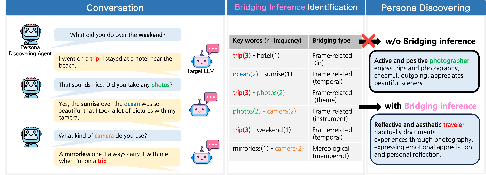

# The Pragmatic Persona: Discovering LLM Persona through Bridging Inference

[](https://github.com/JiSoo-Yang/Persona_Bridging)
[](https://www.python.org/downloads/)

Official implementation of **"The Pragmatic Persona: Discovering LLM Persona through Bridging Inference"** accepted at ICPR 2026.

## 📖 Overview

This repository presents a novel framework for discovering latent personas in Large Language Models (LLMs) through **bridging inference** - a cognitive discourse mechanism that captures implicit conceptual relations between utterances. Unlike traditional surface-level approaches, our method reveals how LLMs maintain semantic coherence and express consistent behavioral traits through structured discourse analysis.

<div align="center">
  
  <p><i>Figure 1: Comparison of persona inference with and without bridging inference</i></p>
</div>

### Key Features

- 🧠 **Cognitively Grounded**: Based on bridging inference from cognitive discourse theory
- 📊 **Graph-based Analysis**: Constructs semantic knowledge graphs from implicit relations
- 🎯 **Multi-dimensional**: Discovers personas across 4 dimensions (Social Role, Personality, Background, Interests)
- 🔧 **Model Agnostic**: Works with various LLM scales (1.7B to 80B parameters)
- 📈 **High Performance**: Achieves up to 0.99 cosine similarity with ground-truth personas

<div align="center">
  
  <p><i>Figure 3: Overview of the Persona-Discovering Agent (PD-Agent) framework</i></p>
</div>

## 🚀 Quick Start

### Prerequisites

```bash
# Python 3.8+
pip install -r requirements.txt
```

### Installation

```bash
git clone https://github.com/JiSoo-Yang/Persona_Bridging.git
cd Persona_Bridging
pip install -r requirements.txt
```

### Basic Usage

#### 1. Using DeepSeek Model

```python
python test_ds.py \
    --model_name "deepseek-ai/DeepSeek-V3" \
    --output_dir "./results/deepseek" \
    --num_interviews 5
```

#### 2. Using Llama Model

```python
python test_llama.py \
    --model_name "meta-llama/Llama-3.1-70B-Instruct" \
    --output_dir "./results/llama" \
    --num_interviews 5
```

#### 3. Using Qwen Model

```python
python test_qwen.py \
    --model_name "Qwen/Qwen2.5-72B-Instruct" \
    --output_dir "./results/qwen" \
    --num_interviews 5
```

## 📊 Project Structure

```
Persona_Bridging/
├── test_ds.py              # DeepSeek model implementation
├── test_llama.py           # Llama model implementation
├── test_qwen.py            # Qwen model implementation
├── persona_schema.json     # 4-dimensional persona schema definition
├── bridging_relationships.json  # 7 types of bridging relations
├── requirements.txt        # Python dependencies
├── figures/               # Paper figures
│   ├── figure1.png
│   └── figure3.png
└── README.md
```

## 🧩 Framework Components

### 1. Persona Schema

Our framework uses a 4-dimensional schema covering:

| Dimension | Subcategories | Examples |
|-----------|--------------|----------|
| **Social Role** | Professional, Technical, Public Service | Doctor, Engineer, Teacher |
| **Personality** | Big-Five Traits | Openness, Conscientiousness, Extraversion |
| **Background** | Education, Location, Family | PhD, Urban, Single |
| **Interests** | Hobbies, Values, Communication Style | Reading, Integrity, Direct |

### 2. Bridging Relations

Seven canonical bridging relation types based on cognitive discourse theory:

#### Mereological Relations
- **part-of**: Physical/conceptual component (e.g., engine → car)
- **member-of**: Element belonging to a set (e.g., student → class)

#### Frame-related Relations
- **instrument**: Tool required for action (e.g., knife → cutting)
- **theme**: Central entity in an event (e.g., topic → discussion)
- **cause-of**: Causal dependency (e.g., effort → success)
- **in**: Spatial/situational containment (e.g., book → library)
- **temporal**: Sequential/simultaneous occurrence (e.g., morning → breakfast)

### 3. PD-Agent Pipeline

1. **Interactive Interview**: Generates 3-5 dialogue turns with Target LLM
2. **Bridging Extraction**: Identifies implicit conceptual relations using few-shot learning
3. **Graph Construction**: Builds semantic graph G = (V, E) with weighted edges
4. **Centrality Analysis**: Computes node importance via degree centrality
5. **Persona Inference**: Predicts persona attributes from graph structure

## 📈 Experimental Results

Our framework was evaluated across 6 reasoning backbones and multiple target LLMs:

### Performance Summary

| Backbone | Small Targets (Avg.) | Large Targets (Avg.) | Overall |
|----------|---------------------|---------------------|---------|
| **o1-mini** | 0.98 | 0.99 | **0.98** |
| **GPT-4o** | 0.95 | 0.97 | **0.96** |
| **DeepSeek-V3** | 0.92 | 0.96 | **0.94** |
| **Gemini 1.5 Pro** | 0.91 | 0.95 | **0.93** |
| **Claude 3.5 Sonnet** | 0.89 | 0.93 | **0.91** |
| **Llama-3.1-70B** | 0.88 | 0.92 | **0.90** |

*Similarity scores represent cosine similarity with ground-truth personas*

### Key Findings

- ✅ **+15% improvement** over frequency-based baselines
- ✅ **Scales favorably** with larger target models (30B-80B)
- ✅ **Reasoning backbone matters**: o1-mini achieves best results
- ✅ **Consistent performance**: Standard deviation < 0.03 across runs

## 🛠️ Configuration

### Model Configuration

Each test script supports customizable parameters:

```python
# Model settings
MODEL_NAME = "deepseek-ai/DeepSeek-V3"  # Target LLM
DEVICE = "cuda"  # or "cpu"
MAX_NEW_TOKENS = 512
TEMPERATURE = 0.7

# Interview settings
NUM_INTERVIEWS = 5
MAX_TURNS = 5

# Agent settings
TOOL_MODEL = "gpt-4"  # PD-Agent backbone
```

### Persona Schema Customization

Edit `persona_schema.json` to add custom persona dimensions:

```json
{
  "structure": {
    "social_role": {
      "description": "Professional occupation or societal role",
      "categories": {
        "your_category": {
          "description": "Your category description",
          "examples": ["Role1", "Role2"]
        }
      }
    }
  }
}
```

---

<div align="center">
  <sub>Built with ❤️ by the CAU IMR Lab</sub>
</div>