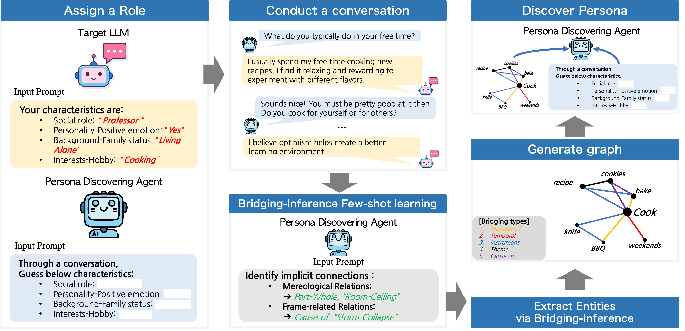

# The Pragmatic Persona: Discovering LLM Persona through Bridging Inference

[](https://github.com/JiSoo-Yang/Persona_Bridging)
[](https://www.python.org/downloads/)

Official implementation of **"The Pragmatic Persona: Discovering LLM Persona through Bridging Inference"** accepted at ICPR 2026.

## Overview

This repository presents a framework for discovering latent personas in Large Language Models (LLMs) through **bridging inference** — a cognitive discourse mechanism that captures implicit conceptual relations between utterances. Unlike surface-level approaches, our method reveals how LLMs maintain semantic coherence and express consistent behavioral traits through structured discourse analysis.

<div align="center">
  
  <p><i>Figure 1: Comparison of persona inference with and without bridging inference</i></p>
</div>

### Key Features

- **Cognitively Grounded**: Based on bridging inference from cognitive discourse theory
- **Graph-based Analysis**: Constructs semantic knowledge graphs from implicit relations
- **Multi-dimensional**: Discovers personas across 4 dimensions (Social Role, Personality, Background, Interests)
- **Model Agnostic**: Works with various LLM scales (1.7B to 80B parameters)

<div align="center">
  
  <p><i>Figure 3: Overview of the Persona-Discovering Agent (PD-Agent) framework</i></p>
</div>

## Repository Structure

```
Persona_Bridging/
├── test/
│   ├── test_ds.py              # DeepSeek target-model experiment
│   ├── test_llama.py           # Llama target-model experiment
│   └── test_qwen.py            # Qwen target-model experiment
├── test_qwen_ablation.py       # Qwen ablation study
├── test_llama_ablation.py      # Llama ablation study
├── schema/
│   ├── persona_schema.json         # 4-dimensional persona schema
│   └── bridging_relationships.json # 7 bridging relation types
├── figures/                    # Paper figures
├── requirements.txt            # Python dependencies
└── README.md
```

## Hardware & Environment

Results in the paper were produced on the following configuration:

| Component | Specification |
|-----------|---------------|
| OS | Linux |
| CPU | 2 × Intel(R) Xeon(R) Gold 6426Y (32 cores / 64 threads) |
| RAM | 256 GB |
| GPU | 4 × NVIDIA RTX Pro 6000 MaxQ (Blackwell), 96 GB VRAM each |

> A CUDA-capable GPU is recommended for running open-source target models (Qwen, Llama, DeepSeek) locally. The PD-Agent reasoning/tool backbone runs through the OpenAI API.

## Installation

```bash
git clone https://github.com/JiSoo-Yang/Persona_Bridging.git
cd Persona_Bridging
pip install -r requirements.txt
```

Python 3.10+ is recommended.

## API Keys (.env setup)

The experiments use the OpenAI API for the PD-Agent (tool/reasoning) backbone and Hugging Face for loading open-source target models. Create a `.env` file **in the repository root**:

```bash
# .env
OPENAI_API_KEY=your-openai-key-here
HF_TOKEN=your-huggingface-token-here   # required for gated models (e.g. Llama)
```

> `.env` is git-ignored and must **not** be committed. Each script automatically loads it at startup.

## Usage

Each experiment script is self-contained. The target model and runtime settings are defined **at the bottom of each script** (no command-line flags). To change them, edit these variables, e.g. in `test/test_qwen.py`:

```python
TARGET_MODEL = "Qwen/Qwen3-1.7B"   # target LLM to probe
num_questions = 3                  # interview turns
device = "cpu"                     # set to "cuda" to use GPU (recommended)
```

Then run **from the repository root** so that `.env` and the `schema/` files are found:

```bash
# Qwen target
python test/test_qwen.py

# Llama target
python test/test_llama.py

# DeepSeek target
python test/test_ds.py
```

At the end of a run, the total execution time is printed:

```
⏱️  Total execution time: XX.XX seconds
```

### Outputs

Results are written to an `outputs/` directory, including:

- `outputs/interview_results_<model>.json` — interview dialogue
- `outputs/bridging_results.json` — extracted bridging relations
- `outputs/graph_structure.json` — semantic graph data
- `outputs/persona_similarity.json` — predicted-vs-ground-truth similarity

### Ablation studies

```bash
python test_qwen_ablation.py
python test_llama_ablation.py
```

## Framework Components

### 1. Persona Schema (`schema/persona_schema.json`)

| Dimension | Subcategories | Examples |
|-----------|--------------|----------|
| **Social Role** | Professional, Technical, Public Service | Doctor, Engineer, Teacher |
| **Personality** | Big-Five Traits | Openness, Conscientiousness, Extraversion |
| **Background** | Education, Location, Family | PhD, Urban, Single |
| **Interests** | Hobbies, Values, Communication Style | Reading, Integrity, Direct |

### 2. Bridging Relations (`schema/bridging_relationships.json`)

Seven canonical bridging relation types based on cognitive discourse theory:

- **Mereological**: `part-of` (engine → car), `member-of` (student → class)
- **Frame-related**: `instrument` (knife → cutting), `theme` (topic → discussion), `cause-of` (effort → success), `in` (book → library), `temporal` (morning → breakfast)

### 3. PD-Agent Pipeline

1. **Interactive Interview**: Generates 3–5 dialogue turns with the target LLM
2. **Bridging Extraction**: Identifies implicit conceptual relations via few-shot learning
3. **Graph Construction**: Builds a semantic graph G = (V, E)
4. **Centrality Analysis**: Computes node importance via degree centrality
5. **Persona Inference**: Predicts persona attributes from graph structure

## Experimental Results

The framework was evaluated across 6 reasoning backbones and multiple target LLMs (see Table 3 in the paper).

| Backbone | Small Targets (Avg.) | Large Targets (Avg.) | Overall |
|----------|---------------------|---------------------|---------|
| **o1-mini** | 0.98 | 0.99 | **0.98** |
| **GPT-4o** | 0.95 | 0.97 | **0.96** |
| **DeepSeek-V3** | 0.92 | 0.96 | **0.94** |
| **Gemini 1.5 Pro** | 0.91 | 0.95 | **0.93** |
| **Claude 3.5 Sonnet** | 0.89 | 0.93 | **0.91** |
| **Llama-3.1-70B** | 0.88 | 0.92 | **0.90** |

*Cosine similarity with ground-truth personas.*

---

<div align="center">
  <sub>Built by the CAU IMR Lab</sub>
</div>
